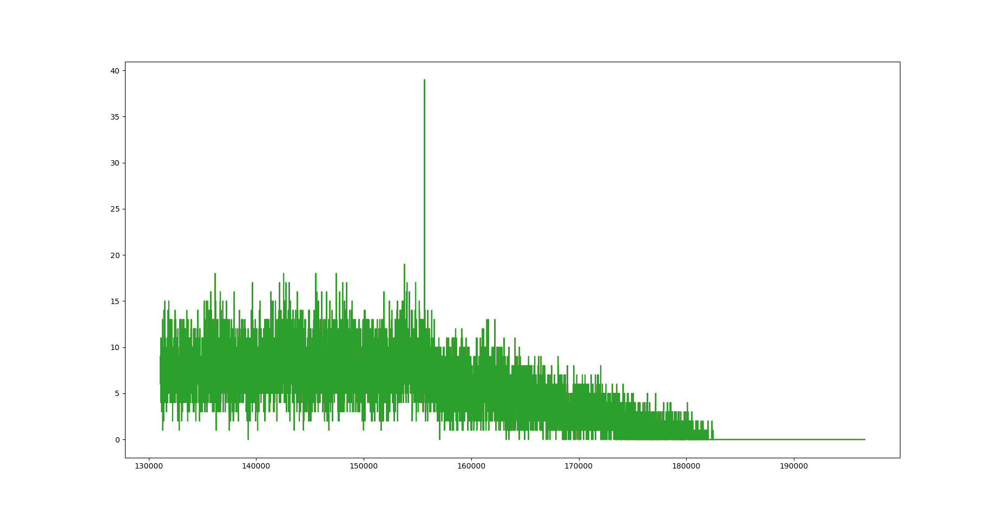

# Get Thumb-2 load address

+ Use to find the load address for thumb2 firmwares.

+ So,It mainly acts on STM32 , nRF52 and other cortex-M architecture processor.

+ Need [**Snippet UI Plugin**](https://github.com/Vector35/snippets)

+ Need to set a guess address range first

  ```python
  #please set guess load address range
  #lange range cause a long time
  guess_base_address_start = 0x20000#YOUR GUESS 
  guess_base_address_end = 0x26010#YOUR GUESS
  #Search accuracy
  acc = 4#YOUR ACC
  ```

+ If there are multiple VMA segments in a bin file, the accuracy of calculation will be reduced.
+ **The search range and precision will greatly affect the search speed. Too large search range and too small precision will lead to search failure. Please set the contraction range and precision reasonably. It is recommended to set it according to the characteristics and development habits of the chip！**
+ The address with the highest flag value is not necessarily the loading base address. Printing a flag diagram like the example below can be used for  analysis.

**TODO**：`function:do_calc_flag` is the most time-consuming function, which can split the task into pieces and process it in parallel by multi-core.

**Example**: the peak value is 0x26000(155648), which is the base address for loading nrf52 firmware



